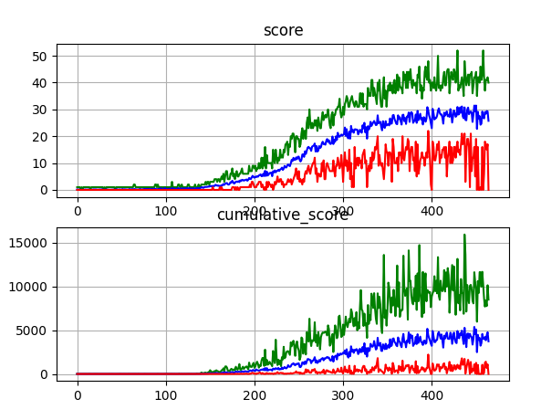
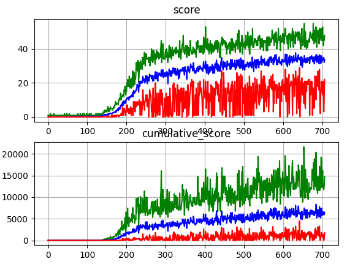

# Idea
  * Train an agent to play snake
  * Give agent full view of the board and let him figure out key features himself
  * Q-function is approximated by neural network
  * Use target network and replay memory

# How to run this?
1. Create virtual environment.
```
python3 -m venv env
```
2. Activate virtual environment.
```
source env/bin/activate
```
3. Install required libraries.
```
pip install -r requirements.txt
```
4. Test pretrained model
```
python test.py ./models/gregor.pt
```
5. Train yourself
```
python deep_q_learning.py
```
or
```
python policy_search.py
```

# MDP

## State Space
A state is made of a `10x10` grid where:
  * `empty` is represented by `-0.1`
  * `body` is represented by `1`
  * `head` is represented by `2`
  * `food` is represented by `3`

## Action Space
There are 4 actions:
  * `left` represented by `0`
  * `right` represented by `1`
  * `up` represented by `2`
  * `down` represented by `3`

## Reward Function
  * `r(s,a) = -2`, if the action results in a crash with wall or body
  * `r(s,a) = 1`, if the agent ate food
  * `r(s,a) = -0.01`, in any other scenario

# Notes

## Network
  * Use CNN to take advantage of spatial structure
  * Without padding, snake struggles to see food at the edge
  * Unsure about size

## Exploration Strategy
  * Epsilon-Greedy doesn't work well because it samples actions that lead to certain death, therefore snake doesn't get long 
  * Softmax works better
  * TODO: Find good temperature decay rate

# Results
I stopped training after 27 hours on my GeForce MX250 which equated to 450 epochs with 20 games each. So in total 9000 games were played. I plotted the maximum, average and minimum score that `gregor` achieved in each epoch as well as a cumulative score where the score at every time step is accumulated. You can run `gregor` with `python test.py models/gregor.pt`



The agent wasn't quite able to get an average score of 30/99 consistently. In a very good game, the agent is able to get to a score of 50/99.

I think the main problem is, that the agent has no memory, therefor it does not know how the snakes tail moves which hinders him in avoiding his own body.

I trained a second model where the body doesn't have a constant value. The values of the body decrease linearly from `1` to `0`. The longer the body remains at this position the higher the value. In theory, the snake should have all information needed to beat the game. I trained for about 50h and the snake got to an average score of 35 which is still disappointing.



You can run `hmm` with `python test.py models/hmm.pt`
